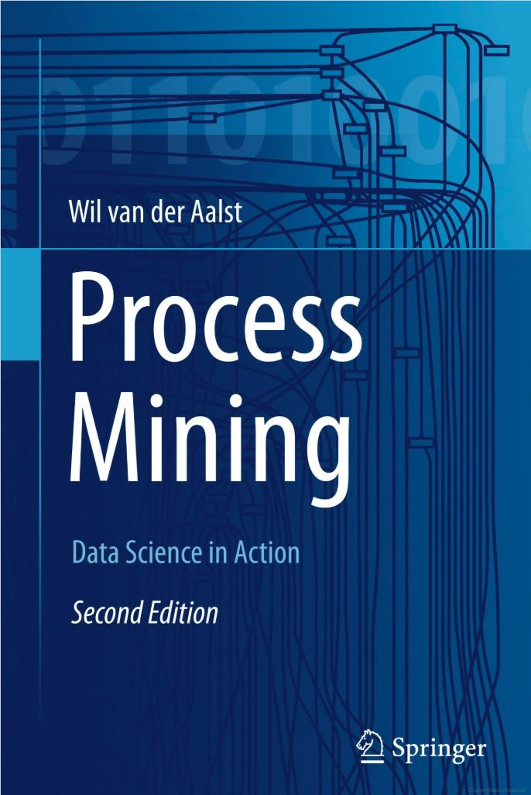

# Literature {#lit}

Here is a review of existing methods.

Process Mining >> [http://processmining.org/]

ProM >> [http://www.promtools.org/doku.php]

Coursera process mining >> [https://www.coursera.org/learn/process-mining]

The book used heavily for reference: 

